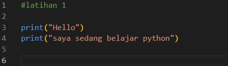
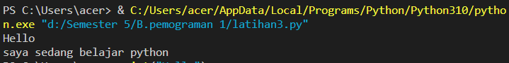
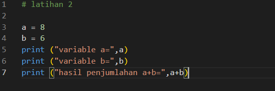
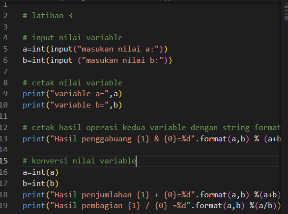
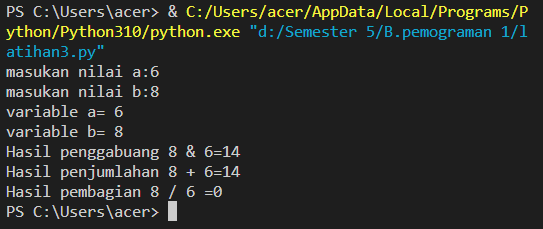

# TUGAS PEMROGRAMAN PERTEMUAN 5
Nama = Fikri abei

Nim  = 312010417

Kelas= TI.22.A.1

# Langkah awal download python
 download python pada web python.org
 buka lalu centang bagian add python to PATH lalu klik install now
 install selesai, klik close
# Latihan 1 menampilkan tulisan hello
menampilkan tulisan "Hello"

Menampilkan tulisan "Saya sedang belajar pyton"

 Lakukan penulisan seperti contoh di bawah:

Hasil dari tulisan diatas:

# Latihan 2 Menjumlahkan dua bilangan menggunakan variabel a dan b
mendefinisikan variabel a dengan nilai 8

mendevinisikan variabel b dengan nilai 6

mencetak nilai variabel a dan b

mencetak hasil penjumlahan a+b

 Lakukan penulisan seperti contoh dibawah:

Hasil dari tulisan diatas:

# Latihan 3 Menjalankan IDLE
Membuat file baru dengan nama latihan3.py (pastikan lokasi file pada folder lab2py pada direktori kerja anda)

Menggunakan fungsi input untuk mengambil nilai variable dari keyboard

 Lakukan penulisan seperti contoh dibawah:

Hasil dari tulisan diatas:

